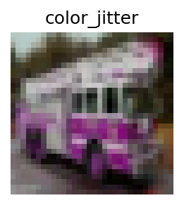
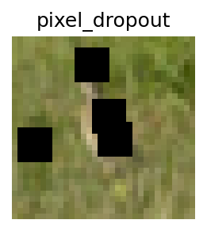
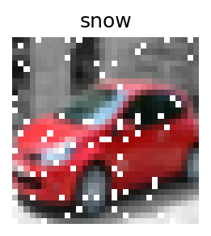

# Advanced Image Corruption Classifier

This project provides a robust PyTorch implementation of a ResNet-18 based Convolutional Neural Network (CNN) designed to identify 12 common types of image corruptions. It serves as a comprehensive, self-contained example of creating a custom on-the-fly data augmentation dataset, defining a modified transfer learning model, and implementing a full training and evaluation pipeline within a Jupyter Notebook.

The model is trained on a dynamically corrupted version of the CIFAR-10 dataset to classify images into categories such as clean, noisy, blurred, or affected by compression artifacts.

## Features

-   **Multi-Class Classification (12 Types)**: Classifies images into a "clean" category and 11 distinct corruption types:
    -   Gaussian Noise
    -   Gaussian Blur
    -   JPEG Compression
    -   Brightness
    -   Contrast
    -   Fog
    -   Snow
    -   Pixel Dropout
    -   Motion Blur
    -   Color Jitter
    -   Grayscale
-   **ResNet-18 Backbone**: Utilizes a ResNet-18 architecture, modified for the 32x32 resolution of CIFAR-10 images, to achieve high classification accuracy.
-   **Dynamic Corruption Dataset**: Implements a custom PyTorch `Dataset` class that dynamically applies corruptions to the base CIFAR-10 dataset. This approach creates a vast and varied training set on the fly without storing augmented images on disk.
-   **Complete Workflow**: The entire machine learning pipeline—data loading, model definition, training, evaluation, and prediction visualization—is included in a single, easy-to-run Jupyter Notebook.
-   **Reproducible**: The notebook includes a fixed random seed to ensure that training and data generation are reproducible.

## Sample Corrupted Images











## Technologies Used

-   **Language**: Python 3
-   **Core Libraries**:
    -   [PyTorch](https://pytorch.org/): For building and training the neural network.
    -   [Torchvision](https://pytorch.org/vision/stable/index.html): For the CIFAR-10 dataset and image transforms.
    -   [Pillow (PIL)](https://python-pillow.org/): For applying image filtering and corruption effects.
    -   [Matplotlib](https://matplotlib.org/): For visualizing data samples and prediction results.
    -   [Jupyter Notebook](https://jupyter.org/): For interactive development and presentation.

## Installation

To run this project locally, a virtual environment is highly recommended. Follow these steps to set up your environment and install the required dependencies.

1.  **Clone the repository:**
    ```bash
    git clone https://github.com/your-username/image-corruption-classifier.git
    cd image-corruption-classifier
    ```

2.  **Create and activate a virtual environment:**
    ```bash
    # Create the environment
    python -m venv venv
    
    # On Windows
    venv\Scripts\activate
    
    # On macOS/Linux
    source venv/bin/activate
    ```

3.  **Install the required dependencies:**
    The project dependencies are listed in `requirements.txt`. Install them using pip:
    ```bash
    pip install -r requirements.txt
    ```
    *(If a `requirements.txt` file is not provided, create one with the following content: `torch`, `torchvision`, `Pillow`, `matplotlib`, `jupyter`)*

## Usage

The entire project workflow is encapsulated within the `ImageCorruptionClassifier.ipynb` notebook.

1.  **Launch Jupyter Notebook:**
    From the project's root directory in your activated virtual environment, run:
    ```bash
    jupyter notebook
    ```

2.  **Open and Run the Notebook:**
    -   Your browser will open the Jupyter interface. Click on `ImageCorruptionClassifier.ipynb`.
    -   To execute the entire notebook, select `Cell > Run All` from the menu bar.
    -   The CIFAR-10 dataset will be automatically downloaded to a `./data` directory on the first run.

3.  **Expected Output:**
    -   Training progress for each of the 10 epochs will be printed, including training/validation loss and accuracy.
    -   Per-corruption accuracy metrics will be displayed after each validation phase.
    -   Once training is complete, the final cell will generate a plot of sample test images, each annotated with its **T**rue and **P**redicted corruption labels.

## Configuration

Key hyperparameters and settings can be easily modified in the "Basic config" cell at the beginning of the notebook.

| Parameter | Description | Default Value |
| :--- | :--- | :--- |
| `SEED` | Random seed for reproducibility. | `42` |
| `DATA_ROOT` | Directory to store the CIFAR-10 dataset. | `"./data"` |
| `BATCH_SIZE` | Number of samples per batch. | `128` |
| `EPOCHS` | Total number of training epochs. | `10` |
| `LEARNING_RATE` | Learning rate for the Adam optimizer. | `1e-3` |

The severity of each corruption is randomized between 1 and 3 during data generation. These levels can be customized within each `add_*` corruption function.

## Model Performance

The model was trained for 10 epochs, achieving a final validation accuracy of **98.11%**.

### Epoch-level Progression

The table below summarizes the model's performance across all training epochs.

| Epoch | Train Loss | Train Acc | Val Loss | Val Acc |
| :---: | :---: | :---: | :---: | :---: |
| 1 | 0.2995 | 88.17% | 0.1597 | 94.21% |
| 2 | 0.1083 | 96.21% | 0.1070 | 96.38% |
| 3 | 0.0797 | 97.31% | 0.0713 | 97.64% |
| 4 | 0.0677 | 97.72% | 0.0649 | 97.83% |
| 5 | 0.0597 | 98.02% | 0.0852 | 97.11% |
| 6 | 0.0528 | 98.19% | 0.0687 | 97.80% |
| 7 | 0.0462 | 98.36% | 0.0657 | 97.90% |
| 8 | 0.0412 | 98.52% | 0.0582 | 98.26% |
| 9 | 0.0381 | 98.61% | 0.0926 | 97.29% |
| 10 | 0.0348 | 98.72% | 0.0754 | 98.11% |

### Per-Corruption Accuracy Table

The final validation accuracy for each corruption type after 10 epochs is detailed below. The model shows strong performance across all categories, with most achieving over 99% accuracy.

| ID | Corruption Type | Validation Accuracy |
| :-: | :--- | :---: |
| 0 | `clean` | 95.37% |
| 1 | `gaussian_noise` | 100.00% |
| 2 | `gaussian_blur` | 99.81% |
| 3 | `jpeg_compression` | 100.00% |
| 4 | `brightness` | 96.30% |
| 5 | `contrast` | 94.17% |
| 6 | `fog` | 99.96% |
| 7 | `snow` | 99.97% |
| 8 | `pixel_dropout` | 99.94% |
| 9 | `motion_blur` | 99.99% |
| 10 | `color_jitter` | 92.03% |
| 11 | `grayscale` | 99.77% |

## Project Structure

```
image-corruption-classifier/
│
├── ImageCorruptionClassifier.ipynb   # Main Jupyter Notebook with all code.
├── requirements.txt                  # List of Python dependencies.
├── README.md                         # This documentation file.
├── training_logs.txt                 # Raw output from the training run.
├── samples/                          # Directory containing sample images for the README.
│   ├── color_jitter.png
│   ├── contrast.png
│   ├── fog.png
│   └── jpeg_compression.png
│   ├── motion_blur.png
│   ├── pixel_dropout.png
│   └── snow.png
└── data/                             # (Created automatically) Stores the CIFAR-10 dataset.
```

## Contributing

Contributions are welcome! If you have suggestions for new features, find a bug, or want to improve the documentation, please feel free to:

1.  **Fork** the repository.
2.  Create a new **branch** (`git checkout -b feature/your-feature-name`).
3.  **Commit** your changes (`git commit -am 'Add some feature'`).
4.  **Push** to the branch (`git push origin feature/your-feature-name`).
5.  Open a **Pull Request**.

Alternatively, you can open an issue with the "bug" or "enhancement" tag.

## License

This project is licensed under the MIT License. See the `LICENSE` file for details.